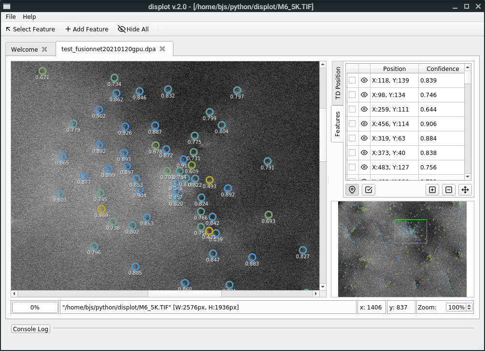

# displot

Displot is a pre-trained machine learning driven semiconductor surface analysis
program. It allows for automated detection of threading dislocations on images
of surfaces obtained using ECCI. The underlying neural network is based on the
[FusionNet][fusionnet] architecture.

## System requirements

16 GB of RAM or more is recommended to avoid OOM errors. If a GPU is available,
it should be automatically detected and used during prediction.

## Install

This program is built using [Python 3.7][python]. If you are going to run it
from a GNU/Linux based OS, you will likely already have it installed. If you
are going to run it from a Windows based machine, it is recommended that you
download an Anaconda distribution.

First clone the repository using git:

    $ git clone https://github.com/bjstarosta/displot

Or manually download and unpack the source code into a directory within
Python's PATH.

The required environment can be reproduced using
[Anaconda][anaconda]/[Miniconda][miniconda]. Depending on whether the OS
you are installing on is GNU/Linux or Windows based, use the appropriate
file when creating the environment:

    $ conda create --name displot --file env-linux64.txt
    OR
    $ conda create --name displot --file env-windows.txt

<!--Alternatively, pip can be used:

    $ pip install -r requirements.txt

Be aware that if using pip it may also be necessary to install Qt5 binaries,
on which this software depends.-->

Once the environment is replicated, activate it using:

    $ conda activate displot

Finally, due to GitHub filesize limits, you will need to separately download
the latest neural network model (about 225MB) and place it in the
displot/weights directory. This will be available for public download soon.
<!-- You will be given an option to do this automatically upon program
launch. -->

## Usage

The user interface can be started by running the following command from the
software directory:

    $ python -m displot

## License

Distributed under the GNU GPLv3 License. See `LICENSE` for more information.

## Versioning

We use [SemVer](http://semver.org/) for versioning. For the versions available,
see the tags on this repository.

## Acknowledgments

* [Feather open source icon pack](https://github.com/feathericons/feather)

## Contact

- E-mail: bohdan.starosta@strath.ac.uk

[fusionnet]: https://arxiv.org/abs/1612.05360
[python]: https://www.python.org/downloads/release/python-379/
[anaconda]: https://www.anaconda.com/
[miniconda]: https://docs.conda.io/en/latest/miniconda.html
